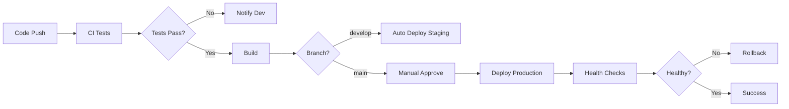

# 🔄 CI/CD Pipeline Configuration - Le Society

**Last Updated:** April 4, 2026  
**Version:** 1.0

---

## 📋 TABLE OF CONTENTS

1. [Overview](#overview)
2. [GitHub Actions](#github-actions)
3. [Bitbucket Pipelines](#bitbucket-pipelines)
4. [GitLab CI/CD](#gitlab-cicd)
5. [Testing Strategy](#testing-strategy)
6. [Deployment Workflows](#deployment-workflows)

---

## OVERVIEW

### CI/CD Goals

✅ **Continuous Integration:**
- Automated testing on every commit
- Code quality checks (linting, formatting)
- Build verification
- Security scanning

✅ **Continuous Deployment:**
- Automated deployment to staging
- Manual approval for production
- Automated rollback on failure
- Health checks post-deployment

---

## GITHUB ACTIONS

### Workflow Files Structure

```
.github/
└── workflows/
    ├── ci.yml                    # Main CI pipeline
    ├── deploy-staging.yml        # Auto-deploy to staging
    ├── deploy-production.yml     # Deploy to production
    └── security-scan.yml         # Security checks
```

### 1. Main CI Pipeline

**File: `.github/workflows/ci.yml`**

```yaml
name: CI Pipeline

on:
  push:
    branches: [develop, main]
  pull_request:
    branches: [develop, main]

env:
  NODE_VERSION: '16.x'

jobs:
  lint:
    name: Lint Code
    runs-on: ubuntu-latest
    
    steps:
      - uses: actions/checkout@v3
      
      - name: Setup Node.js
        uses: actions/setup-node@v3
        with:
          node-version: ${{ env.NODE_VERSION }}
          cache: 'npm'
      
      - name: Install dependencies (Backend)
        working-directory: lesociety/latest/home/node/secret-time-next-api
        run: npm ci
      
      - name: Lint backend
        working-directory: lesociety/latest/home/node/secret-time-next-api
        run: npm run lint || echo "No lint script configured"
      
      - name: Install dependencies (Frontend)
        working-directory: lesociety/latest/home/node/secret-time-next
        run: npm ci
      
      - name: Lint frontend
        working-directory: lesociety/latest/home/node/secret-time-next
        run: npm run lint || echo "No lint script configured"

  test-backend:
    name: Test Backend
    runs-on: ubuntu-latest
    
    services:
      mongodb:
        image: mongo:5.0
        ports:
          - 27017:27017
        env:
          MONGO_INITDB_DATABASE: lesociety_test
    
    steps:
      - uses: actions/checkout@v3
      
      - name: Setup Node.js
        uses: actions/setup-node@v3
        with:
          node-version: ${{ env.NODE_VERSION }}
          cache: 'npm'
      
      - name: Install dependencies
        working-directory: lesociety/latest/home/node/secret-time-next-api
        run: npm ci
      
      - name: Run tests
        working-directory: lesociety/latest/home/node/secret-time-next-api
        env:
          MONGO_URI: mongodb://localhost:27017/lesociety_test
          JWT_SECRET_TOKEN: test-secret-token
          NODE_ENV: test
        run: npm test || echo "No tests configured yet"
      
      - name: Upload coverage
        uses: codecov/codecov-action@v3
        if: always()
        with:
          files: ./lesociety/latest/home/node/secret-time-next-api/coverage/lcov.info
          fail_ci_if_error: false

  test-frontend:
    name: Test Frontend
    runs-on: ubuntu-latest
    
    steps:
      - uses: actions/checkout@v3
      
      - name: Setup Node.js
        uses: actions/setup-node@v3
        with:
          node-version: ${{ env.NODE_VERSION }}
          cache: 'npm'
      
      - name: Install dependencies
        working-directory: lesociety/latest/home/node/secret-time-next
        run: npm ci
      
      - name: Run tests
        working-directory: lesociety/latest/home/node/secret-time-next
        run: npm test || echo "No tests configured yet"

  build:
    name: Build Application
    runs-on: ubuntu-latest
    needs: [lint, test-backend, test-frontend]
    
    steps:
      - uses: actions/checkout@v3
      
      - name: Setup Node.js
        uses: actions/setup-node@v3
        with:
          node-version: ${{ env.NODE_VERSION }}
          cache: 'npm'
      
      - name: Build backend
        working-directory: lesociety/latest/home/node/secret-time-next-api
        run: |
          npm ci
          echo "Backend build complete"
      
      - name: Build frontend
        working-directory: lesociety/latest/home/node/secret-time-next
        env:
          NEXT_PUBLIC_API_URL: https://api-staging.lesociety.com
        run: |
          npm ci
          npm run build
      
      - name: Upload build artifacts
        uses: actions/upload-artifact@v3
        with:
          name: frontend-build
          path: lesociety/latest/home/node/secret-time-next/.next
          retention-days: 7

  security-scan:
    name: Security Scan
    runs-on: ubuntu-latest
    
    steps:
      - uses: actions/checkout@v3
      
      - name: Run npm audit (Backend)
        working-directory: lesociety/latest/home/node/secret-time-next-api
        run: npm audit --audit-level=moderate || true
      
      - name: Run npm audit (Frontend)
        working-directory: lesociety/latest/home/node/secret-time-next
        run: npm audit --audit-level=moderate || true
```

### 2. Staging Deployment

**File: `.github/workflows/deploy-staging.yml`**

```yaml
name: Deploy to Staging

on:
  push:
    branches: [develop]

env:
  NODE_VERSION: '16.x'

jobs:
  deploy:
    name: Deploy to Staging
    runs-on: ubuntu-latest
    environment: staging
    
    steps:
      - uses: actions/checkout@v3
      
      - name: Setup Node.js
        uses: actions/setup-node@v3
        with:
          node-version: ${{ env.NODE_VERSION }}
      
      - name: Deploy to Render (Backend)
        env:
          RENDER_API_KEY: ${{ secrets.RENDER_API_KEY }}
          RENDER_SERVICE_ID: ${{ secrets.RENDER_BACKEND_STAGING_ID }}
        run: |
          curl -X POST \
            -H "Authorization: Bearer $RENDER_API_KEY" \
            "https://api.render.com/v1/services/$RENDER_SERVICE_ID/deploys"
      
      - name: Deploy to Vercel (Frontend)
        uses: amondnet/vercel-action@v20
        with:
          vercel-token: ${{ secrets.VERCEL_TOKEN }}
          vercel-org-id: ${{ secrets.VERCEL_ORG_ID }}
          vercel-project-id: ${{ secrets.VERCEL_PROJECT_ID }}
          working-directory: lesociety/latest/home/node/secret-time-next
          scope: ${{ secrets.VERCEL_ORG_ID }}
      
      - name: Wait for deployment
        run: sleep 60
      
      - name: Health check
        run: |
          curl -f https://api-staging.lesociety.com/health || exit 1
          curl -f https://staging.lesociety.com || exit 1
      
      - name: Notify Slack
        uses: 8398a7/action-slack@v3
        if: always()
        with:
          status: ${{ job.status }}
          text: 'Staging deployment ${{ job.status }}'
          webhook_url: ${{ secrets.SLACK_WEBHOOK }}
```

### 3. Production Deployment

**File: `.github/workflows/deploy-production.yml`**

```yaml
name: Deploy to Production

on:
  push:
    branches: [main]
  workflow_dispatch:
    inputs:
      version:
        description: 'Version to deploy'
        required: true
        default: 'latest'

env:
  NODE_VERSION: '16.x'

jobs:
  approval:
    name: Manual Approval
    runs-on: ubuntu-latest
    steps:
      - name: Wait for approval
        uses: trstringer/manual-approval@v1
        with:
          secret: ${{ github.TOKEN }}
          approvers: admin-team
          minimum-approvals: 1
          issue-title: "Production Deployment Approval"

  deploy:
    name: Deploy to Production
    runs-on: ubuntu-latest
    needs: approval
    environment: production
    
    steps:
      - uses: actions/checkout@v3
      
      - name: Create deployment tag
        run: |
          git tag -a "v${{ github.run_number }}" -m "Production deployment"
          git push origin "v${{ github.run_number }}"
      
      - name: Backup database
        env:
          MONGO_URI: ${{ secrets.MONGO_URI_PRODUCTION }}
        run: |
          chmod +x ./backup-database.sh
          ./backup-database.sh
      
      - name: Deploy to Render (Backend)
        env:
          RENDER_API_KEY: ${{ secrets.RENDER_API_KEY }}
          RENDER_SERVICE_ID: ${{ secrets.RENDER_BACKEND_PRODUCTION_ID }}
        run: |
          curl -X POST \
            -H "Authorization: Bearer $RENDER_API_KEY" \
            "https://api.render.com/v1/services/$RENDER_SERVICE_ID/deploys"
      
      - name: Deploy to Vercel (Frontend)
        uses: amondnet/vercel-action@v20
        with:
          vercel-token: ${{ secrets.VERCEL_TOKEN }}
          vercel-org-id: ${{ secrets.VERCEL_ORG_ID }}
          vercel-project-id: ${{ secrets.VERCEL_PROJECT_ID }}
          vercel-args: '--prod'
          working-directory: lesociety/latest/home/node/secret-time-next
      
      - name: Wait for deployment
        run: sleep 90
      
      - name: Health checks
        run: |
          chmod +x ./test-production-readiness.sh
          ./test-production-readiness.sh
      
      - name: Rollback on failure
        if: failure()
        run: |
          echo "Deployment failed! Rolling back..."
          chmod +x ./rollback.sh
          ./rollback.sh
      
      - name: Notify team
        uses: 8398a7/action-slack@v3
        if: always()
        with:
          status: ${{ job.status }}
          text: 'Production deployment ${{ job.status }}'
          webhook_url: ${{ secrets.SLACK_WEBHOOK }}
          fields: repo,message,commit,author
```

---

## BITBUCKET PIPELINES

### Configuration File

**File: `bitbucket-pipelines.yml`**

```yaml
image: node:16

definitions:
  services:
    mongo:
      image: mongo:5.0
      environment:
        MONGO_INITDB_DATABASE: lesociety_test
  
  caches:
    npm-backend: lesociety/latest/home/node/secret-time-next-api/node_modules
    npm-frontend: lesociety/latest/home/node/secret-time-next/node_modules

  steps:
    - step: &lint-backend
        name: Lint Backend
        caches:
          - npm-backend
        script:
          - cd lesociety/latest/home/node/secret-time-next-api
          - npm ci
          - npm run lint || echo "No lint configured"
    
    - step: &lint-frontend
        name: Lint Frontend
        caches:
          - npm-frontend
        script:
          - cd lesociety/latest/home/node/secret-time-next
          - npm ci
          - npm run lint || echo "No lint configured"
    
    - step: &test-backend
        name: Test Backend
        services:
          - mongo
        caches:
          - npm-backend
        script:
          - cd lesociety/latest/home/node/secret-time-next-api
          - npm ci
          - export MONGO_URI=mongodb://localhost:27017/lesociety_test
          - export JWT_SECRET_TOKEN=test-secret-token
          - export NODE_ENV=test
          - npm test || echo "No tests configured"
    
    - step: &test-frontend
        name: Test Frontend
        caches:
          - npm-frontend
        script:
          - cd lesociety/latest/home/node/secret-time-next
          - npm ci
          - npm test || echo "No tests configured"
    
    - step: &build-frontend
        name: Build Frontend
        caches:
          - npm-frontend
        script:
          - cd lesociety/latest/home/node/secret-time-next
          - npm ci
          - npm run build
        artifacts:
          - lesociety/latest/home/node/secret-time-next/.next/**
    
    - step: &deploy-staging
        name: Deploy to Staging
        deployment: staging
        script:
          - pipe: atlassian/trigger-pipeline:5.0.0
            variables:
              BITBUCKET_USERNAME: $BITBUCKET_USERNAME
              BITBUCKET_APP_PASSWORD: $BITBUCKET_APP_PASSWORD
              REPOSITORY: 'your-repo'
              REF_NAME: 'develop'
          - sleep 60
          - curl -f https://api-staging.lesociety.com/health || exit 1
    
    - step: &deploy-production
        name: Deploy to Production
        deployment: production
        trigger: manual
        script:
          - ./backup-database.sh
          - ./deploy-production.sh
          - sleep 90
          - ./test-production-readiness.sh

pipelines:
  default:
    - parallel:
      - step: *lint-backend
      - step: *lint-frontend
    - parallel:
      - step: *test-backend
      - step: *test-frontend
    - step: *build-frontend
  
  branches:
    develop:
      - parallel:
        - step: *lint-backend
        - step: *lint-frontend
      - parallel:
        - step: *test-backend
        - step: *test-frontend
      - step: *build-frontend
      - step: *deploy-staging
    
    main:
      - parallel:
        - step: *lint-backend
        - step: *lint-frontend
      - parallel:
        - step: *test-backend
        - step: *test-frontend
      - step: *build-frontend
      - step: *deploy-production

  pull-requests:
    '**':
      - parallel:
        - step: *lint-backend
        - step: *lint-frontend
      - parallel:
        - step: *test-backend
        - step: *test-frontend
      - step: *build-frontend
```

---

## GITLAB CI/CD

### Configuration File

**File: `.gitlab-ci.yml`**

```yaml
image: node:16

stages:
  - lint
  - test
  - build
  - deploy

variables:
  NODE_ENV: test

cache:
  paths:
    - lesociety/latest/home/node/secret-time-next-api/node_modules/
    - lesociety/latest/home/node/secret-time-next/node_modules/

lint:backend:
  stage: lint
  script:
    - cd lesociety/latest/home/node/secret-time-next-api
    - npm ci
    - npm run lint || echo "No lint configured"

lint:frontend:
  stage: lint
  script:
    - cd lesociety/latest/home/node/secret-time-next
    - npm ci
    - npm run lint || echo "No lint configured"

test:backend:
  stage: test
  services:
    - mongo:5.0
  variables:
    MONGO_URI: mongodb://mongo:27017/lesociety_test
    JWT_SECRET_TOKEN: test-secret-token
  script:
    - cd lesociety/latest/home/node/secret-time-next-api
    - npm ci
    - npm test || echo "No tests configured"
  coverage: '/Statements\s*:\s*(\d+\.?\d*)%/'

test:frontend:
  stage: test
  script:
    - cd lesociety/latest/home/node/secret-time-next
    - npm ci
    - npm test || echo "No tests configured"

build:frontend:
  stage: build
  script:
    - cd lesociety/latest/home/node/secret-time-next
    - npm ci
    - npm run build
  artifacts:
    paths:
      - lesociety/latest/home/node/secret-time-next/.next/
    expire_in: 1 week

deploy:staging:
  stage: deploy
  environment:
    name: staging
    url: https://staging.lesociety.com
  only:
    - develop
  script:
    - ./deploy-production.sh staging
    - sleep 60
    - curl -f https://api-staging.lesociety.com/health || exit 1

deploy:production:
  stage: deploy
  environment:
    name: production
    url: https://lesociety.com
  only:
    - main
  when: manual
  script:
    - ./backup-database.sh
    - ./deploy-production.sh production
    - sleep 90
    - ./test-production-readiness.sh
```

---

## TESTING STRATEGY

### Test Pyramid

```
       /\
      /  \    E2E Tests (10%)
     /____\
    /      \  Integration Tests (30%)
   /________\
  /          \ Unit Tests (60%)
 /__________\
```

### 1. Unit Tests

**Backend example:**

```javascript
// tests/unit/user.test.js
const { validateEmail } = require('../../helpers/validation');

describe('User Validation', () => {
  test('should validate correct email', () => {
    expect(validateEmail('test@example.com')).toBe(true);
  });
  
  test('should reject invalid email', () => {
    expect(validateEmail('invalid')).toBe(false);
  });
});
```

### 2. Integration Tests

```javascript
// tests/integration/auth.test.js
const request = require('supertest');
const app = require('../../app');

describe('POST /api/v1/user/login', () => {
  test('should login with valid credentials', async () => {
    const res = await request(app)
      .post('/api/v1/user/login')
      .send({
        email: 'test@example.com',
        password: '123456'
      });
    
    expect(res.statusCode).toBe(200);
    expect(res.body).toHaveProperty('token');
  });
});
```

### 3. E2E Tests

```javascript
// tests/e2e/user-flow.spec.js (Playwright)
const { test, expect } = require('@playwright/test');

test('user can register and login', async ({ page }) => {
  // Navigate to signup
  await page.goto('http://localhost:3000');
  await page.click('text=Sign Up');
  
  // Fill form
  await page.fill('[name="email"]', 'test@example.com');
  await page.fill('[name="password"]', 'password123');
  await page.click('button[type="submit"]');
  
  // Verify redirect
  await expect(page).toHaveURL(/\/dashboard/);
});
```

---

## DEPLOYMENT WORKFLOWS

### Branch Strategy

```
main (production)
  ↑
develop (staging)
  ↑
feature/* (dev environment)
```

### Deployment Process



---

## SECRETS MANAGEMENT

### Required Secrets

**GitHub/GitLab/Bitbucket:**

```bash
# Database
MONGO_URI_PRODUCTION
MONGO_URI_STAGING

# JWT
JWT_SECRET_TOKEN

# Deployment
RENDER_API_KEY
RENDER_BACKEND_STAGING_ID
RENDER_BACKEND_PRODUCTION_ID
VERCEL_TOKEN
VERCEL_ORG_ID
VERCEL_PROJECT_ID

# Notifications
SLACK_WEBHOOK

# External Services
SUPABASE_URL
SUPABASE_KEY
SENDGRID_API_KEY
```

---

## IMPLEMENTATION CHECKLIST

- [ ] Choose CI/CD platform (GitHub Actions/Bitbucket/GitLab)
- [ ] Create workflow files
- [ ] Configure secrets
- [ ] Set up environments (staging, production)
- [ ] Configure branch protection rules
- [ ] Set up automated tests
- [ ] Configure deployment hooks
- [ ] Set up notifications (Slack/Email)
- [ ] Test rollback procedures
- [ ] Document deployment process

---

**Last Updated:** April 4, 2026  
**Maintained By:** DevOps Team
